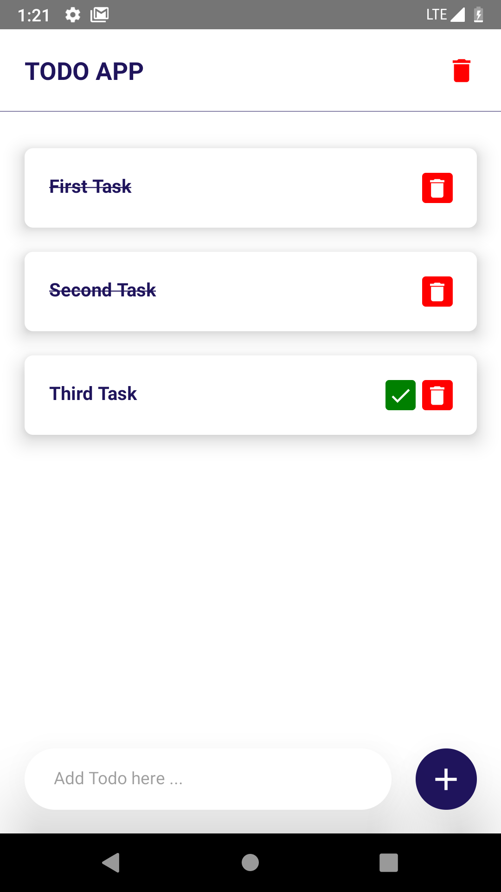

# ToDo application

implementation ToDo simple application using react native.

# usage:

make sure you already installed node js

- `npx react-native init name_project_folder` let it finished
- after installed 2 libraries [vector icons & async storage], make sure those are linked
- type `npx react-native link`

# library used:

- `npm install --save react-native-vector-icons`
- `npm install @react-native-async-storage/async-storage`

# Screenshot

